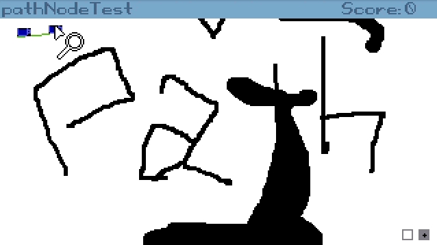

# agspathfinder

🚨EXPERIMENTAL🚨 | [](https://dev.azure.com/ericoporto/agspathfinder/_build/latest?definitionId=8&branchName=master)

**AGS Pathfinder Plugin**



This plugin has copy of the actual pathfinder used by Adventure Game Studio,
and exposes an interface to interact directly with it.

I added the experimental note above because I believe that once the API for it
is figured out, it's facilities would be provided by AGS Engine and this Plugin
would then not make sense and cease development.

## AGS Pathfinder usage

Pathfinding is provided in three steps.

1. Set the map, Pathfinder will generate the nodes. Don't do this every frame.

2. Get the path as a vector by passing an origin and a destination.
   If your node map is not too gigantic, this should be very fast.
   If start and end of the vector doesn't match your origin and destination, no
   path was found. Ideally the vector returned should be empty.

3. Consume the returned vector and do something with it.

```
// 1 Pass sprite 1 to be used as map
AgsPathfinder.SetGridFromSprite(1);

// 2 Calculates the path and returns a vector containing all the nodes
PathNodeArray* pathNodeArr = AgsPathfinder.GetPathFromTo(origin_X, origin_Y, destination_X, destination_Y);

// 3 Consume your path node by node
while(!pathNodeArr.Empty()){
  PathNode* pathNode = pathNodeArr.Pop();
  // do something with pathNode.X and pathNode.Y
}

```

### AGS Pathfinder Script API


**`void AgsPathfinder.SetGridFromSprite(int sprite)`**

Pass a sprite to be used as the walkable map. Real black (000000) identifies walls.

**`PathNodeArray* GetPathFromTo(int origin_x, int origin_y, int destination_x, int destination_y)`**

Get a PathNodeArray containing each Node of the path for the provided origin and destination.


## Building AGS Pathfinder plugin

first you need to clone this repository to the folder you clone your repos (ex: ~/git).

If you haven't already, also clone AGS and set the branch for ags3.

```
git clone https://github.com/ericoporto/agspathfinder.git
git clone https://github.com/adventuregamestudio/ags.git
pushd ags
git checkout ags3
popd
```

### Windows

Just load the solution on Visual Studio 2019 or 2017, and hit build.

It depends on v140 tools and should theoretically also build in VS 2015.

### Linux

Just type make in the folder with the `Makefile`.

```
cd agspathfinder/agspathfinder/
make
```

### MacOS

MacOS build is untested, but should work the same way as Linux.


## Licence

This plugin interface is made using code from Adventure Game Studio itself, as
such, it has Artistic License 2.0 [`LICENSE`](LICENSE).
